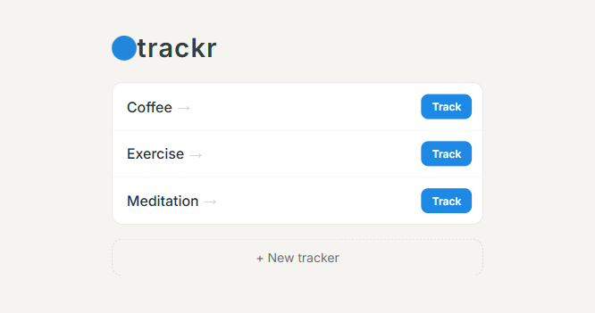

# trackr

Hit a button. See how often you do things. Dead simple.



## Run

Three ways to run it, all still dead simple.

```
node server.js
```

**Docker**

```
docker run -p 3000:3000 -v trackr-data:/data -e DB_PATH=/data/trackr.db ghcr.io/saintedlama/trackr
```

**Docker Compose**

Uses the included [`docker-compose.yml`](docker-compose.yml).

```
docker compose up
```
